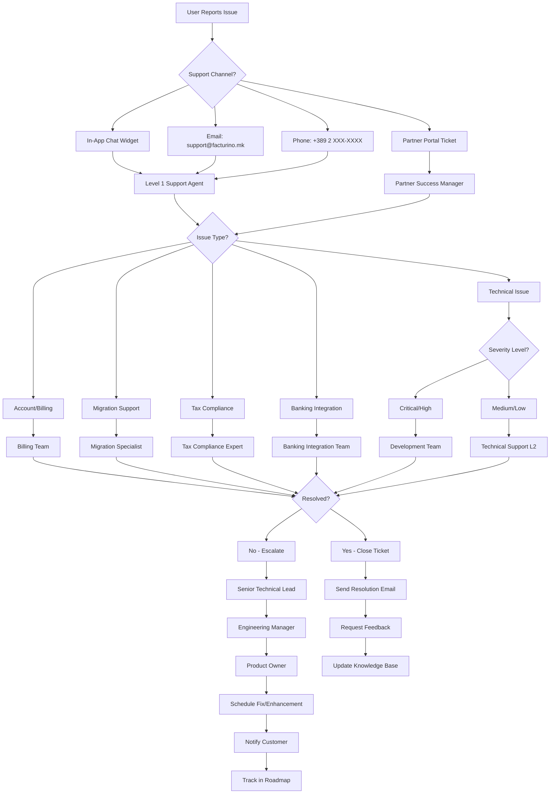

# FACTURINO Support Desk Process Flowchart

**Document Version**: 1.0  
**Last Updated**: July 26, 2025  
**Target Audience**: Support Team, Partner Bureaus, Development Team

---

## 📋 Overview

This document outlines the comprehensive support process for Facturino Macedonia, covering all support channels and escalation procedures for partner bureaus and end-users.

## 🎯 Support Objectives

- **Response Time**: <4 hours for critical issues, <24 hours for standard issues
- **Resolution Rate**: >90% first-contact resolution for Level 1 issues
- **Customer Satisfaction**: >95% satisfaction rating
- **Escalation**: Clear path for complex technical issues

---

## 📊 Support Process Flowchart

---

## 🏷️ Support Categories & Routing

### **Level 1 Support (First Contact)**
**Scope**: General inquiries, basic troubleshooting, account access
- ✅ Password resets and login issues
- ✅ Basic navigation and feature explanation
- ✅ Invoice creation and customer management
- ✅ Payment processing guidance
- ✅ General platform questions

**SLA**: Response within 4 hours, Resolution within 24 hours

### **Level 2 Technical Support**
**Scope**: Complex technical issues, system integrations
- 🔧 API integration problems
- 🔧 Custom field configuration
- 🔧 Performance optimization
- 🔧 Data export/import issues
- 🔧 Multi-company setup

**SLA**: Response within 8 hours, Resolution within 48 hours

### **Specialized Support Teams**

#### **Migration Specialists**
- 📊 Universal Migration Wizard issues
- 📊 Field mapping problems
- 📊 Data validation errors
- 📊 Competitor data import
- 📊 Large dataset processing

#### **Tax Compliance Experts**
- 🏛️ ДДВ-04 VAT return generation
- 🏛️ UBL XML export issues
- 🏛️ Digital signature problems
- 🏛️ Macedonia tax law compliance
- 🏛️ E-faktura portal integration

#### **Banking Integration Team**
- 🏦 PSD2 API connection issues
- 🏦 Transaction sync problems
- 🏦 Bank authorization failures
- 🏦 Payment matching errors
- 🏦 Multi-bank configuration

#### **Partner Success Managers**
- 🤝 Partner bureau onboarding
- 🤝 Multi-client setup assistance
- 🤝 Commission tracking issues
- 🤝 Partner console problems
- 🤝 Business growth consultation

---

## 🚨 Escalation Matrix

### **Priority Levels**

#### **🔴 Critical (P1)**
- Platform completely down
- Data loss or corruption
- Security breach
- Payment processing failure
- Tax compliance blocking issue

**Response**: Immediate (within 1 hour)
**Escalation**: Direct to Development Team + Engineering Manager

#### **🟡 High (P2)**
- Feature not working for multiple users
- Banking sync failures
- Migration wizard errors
- Partner console access issues

**Response**: Within 4 hours
**Escalation**: Level 2 Technical Support

#### **🟢 Medium (P3)**
- Single user feature issues
- Minor UI/UX problems
- Documentation requests
- Training needs

**Response**: Within 24 hours
**Escalation**: Appropriate specialist team

#### **⚪ Low (P4)**
- Feature requests
- Enhancement suggestions
- General questions
- Best practice guidance

**Response**: Within 48 hours
**Escalation**: Product team for roadmap consideration

---

## 📞 Support Channels & Contact Information

### **Primary Support Channels**

#### **In-App Chat Widget**
- **Availability**: 24/7 (automated) + Business hours (live)
- **Response Time**: Immediate for automated, <2 hours for live
- **Best For**: Quick questions, basic troubleshooting
- **Features**: Screen sharing, file upload, ticket creation

#### **Email Support**
- **Address**: support@facturino.mk
- **Response Time**: <4 hours business days, <24 hours weekends
- **Best For**: Detailed issues, documentation, formal requests
- **Auto-Reply**: Ticket number and expected response time

#### **Phone Support**
- **Number**: +389 2 XXX-XXXX
- **Hours**: Monday-Friday 8:00-18:00 CET
- **Languages**: Macedonian, Albanian, English
- **Best For**: Urgent issues, complex explanations

#### **Partner Portal**
- **URL**: partners.facturino.mk/support
- **Features**: Priority routing, dedicated partner success manager
- **Best For**: Partner-specific issues, multi-client problems

### **Specialized Contact Points**

#### **Technical Support**
- **Email**: tech@facturino.mk
- **Focus**: API issues, integrations, complex configurations

#### **Banking Support**
- **Email**: banking@facturino.mk
- **Focus**: PSD2 connections, bank sync, payment matching

#### **Tax Compliance**
- **Email**: tax@facturino.mk
- **Focus**: ДДВ-04 returns, UBL XML, digital signatures

#### **Emergency Hotline**
- **Number**: +389 70 XXX-XXX
- **Availability**: 24/7 for critical issues only
- **Usage**: Platform down, data loss, security incidents

---

## 🔄 Ticket Lifecycle Management

### **Ticket Creation**
1. **Automatic Ticket Generation** from all channels
2. **Unique Ticket ID** (format: FAC-YYYYMMDD-NNNN)
3. **Initial Classification** by channel and keywords
4. **Priority Assignment** based on issue description
5. **Routing to Appropriate Team** via automated rules

### **Ticket Tracking**
- **Status Updates**: Created → Assigned → In Progress → Resolved → Closed
- **Customer Notifications**: Email updates on status changes
- **Internal Notes**: Technical details and troubleshooting steps
- **Time Tracking**: Response time and resolution time metrics

### **Resolution Process**
1. **Investigation**: Reproduce issue and identify root cause
2. **Solution Development**: Create fix or workaround
3. **Testing**: Verify solution in staging environment
4. **Implementation**: Apply fix to production (if needed)
5. **Customer Communication**: Explain resolution and next steps
6. **Follow-up**: Confirm customer satisfaction

### **Knowledge Base Updates**
- **Document Solutions** for recurring issues
- **Create FAQ Entries** for common questions
- **Update User Guides** with new procedures
- **Share with Team** via internal wiki

---

## 🎓 Support Team Training & Resources

### **Required Knowledge Areas**

#### **Platform Expertise**
- ✅ Complete feature understanding
- ✅ Macedonia business workflows
- ✅ Tax compliance requirements
- ✅ Banking integration processes
- ✅ Migration wizard capabilities

#### **Technical Skills**
- 🔧 Basic troubleshooting
- 🔧 Browser developer tools
- 🔧 API testing tools
- 🔧 Database query basics
- 🔧 Log file analysis

#### **Language Requirements**
- 🗣️ **Macedonian**: Native or fluent
- 🗣️ **Albanian**: Conversational
- 🗣️ **English**: Technical proficiency

### **Training Materials**
- 📚 **Internal Wiki**: Comprehensive platform documentation
- 🎥 **Video Library**: Feature walkthroughs and troubleshooting
- 🧪 **Sandbox Environment**: Practice platform for testing
- 📋 **Escalation Guides**: When and how to escalate issues
- 🎯 **Customer Service**: Communication best practices

### **Certification Requirements**
- ✅ **Platform Certification**: Pass feature knowledge test
- ✅ **Macedonia Compliance**: Tax and banking law basics
- ✅ **Customer Service**: Communication and problem-solving
- ✅ **Security Awareness**: Data protection and privacy

---

## 📊 Performance Metrics & KPIs

### **Response Time Metrics**
- **First Response Time**: Time from ticket creation to first agent response
- **Target**: <4 hours for standard, <1 hour for critical
- **Measurement**: Automated tracking via ticketing system

### **Resolution Metrics**
- **First Contact Resolution**: Issues resolved without escalation
- **Target**: >90% for Level 1 issues
- **Average Resolution Time**: Time from creation to resolution
- **Target**: <24 hours for standard, <4 hours for critical

### **Quality Metrics**
- **Customer Satisfaction Score**: Post-resolution survey rating
- **Target**: >95% satisfied or very satisfied
- **Reopened Tickets**: Tickets requiring additional work
- **Target**: <5% of resolved tickets

### **Volume Metrics**
- **Tickets per Channel**: Distribution across support channels
- **Tickets per Category**: Common issue types and frequencies
- **Peak Hours**: Busy times for resource planning

### **Team Performance**
- **Agent Utilization**: Time spent on tickets vs. available time
- **Escalation Rate**: Percentage of tickets requiring escalation
- **Knowledge Base Usage**: Self-service resolution rate

---

## 🛠️ Tools & Systems

### **Ticketing System**
- **Platform**: Zendesk/Freshdesk (or similar)
- **Features**: Automated routing, SLA tracking, customer portal
- **Integration**: Connected to Facturino user database

### **Communication Tools**
- **Chat Widget**: Intercom/Crisp for in-app messaging
- **Phone System**: VoIP with call recording and routing
- **Video Conferencing**: Zoom/Teams for screen sharing

### **Technical Tools**
- **Monitoring**: Application and server monitoring dashboards
- **Logs**: Centralized logging with search capabilities
- **Testing**: Staging environment for issue reproduction
- **API Tools**: Postman collections for API testing

### **Knowledge Management**
- **Internal Wiki**: Confluence/Notion for documentation
- **FAQ System**: Customer-facing help center
- **Video Library**: Loom recordings for visual guides
- **Decision Trees**: Automated troubleshooting flows

---

## 🔄 Continuous Improvement

### **Feedback Collection**
- **Customer Surveys**: Post-resolution satisfaction surveys
- **Partner Feedback**: Regular partner bureau check-ins
- **Agent Input**: Weekly team meetings for process improvement
- **Data Analysis**: Monthly review of metrics and trends

### **Process Optimization**
- **Automation**: Identify repetitive tasks for automation
- **Self-Service**: Expand knowledge base and FAQ coverage
- **Training Updates**: Regular updates based on new features
- **Tool Evaluation**: Annual review of support tools and efficiency

### **Quality Assurance**
- **Ticket Reviews**: Random sampling of resolved tickets
- **Customer Callbacks**: Proactive follow-up on critical issues
- **Agent Coaching**: Individual performance improvement plans
- **Best Practice Sharing**: Monthly team knowledge sharing

---

## 📋 Support Process Checklist

### **For Support Agents**

#### **Ticket Receipt**
- [ ] Acknowledge ticket within SLA timeframe
- [ ] Classify issue type and priority level
- [ ] Gather all relevant information from customer
- [ ] Check knowledge base for existing solutions
- [ ] Reproduce issue if possible

#### **Investigation**
- [ ] Review customer account and configuration
- [ ] Check system logs for error messages
- [ ] Test similar scenarios in staging environment
- [ ] Consult with team members if needed
- [ ] Document all troubleshooting steps

#### **Resolution**
- [ ] Implement solution or workaround
- [ ] Test resolution with customer
- [ ] Provide clear explanation and documentation
- [ ] Update ticket with complete resolution details
- [ ] Follow up to ensure customer satisfaction

#### **Escalation (if needed)**
- [ ] Document all attempted solutions
- [ ] Provide clear escalation summary
- [ ] Include customer impact assessment
- [ ] Set appropriate expectations with customer
- [ ] Transfer to appropriate specialist team

### **For Managers**

#### **Daily Operations**
- [ ] Review overnight tickets and priorities
- [ ] Check SLA compliance and response times
- [ ] Monitor team workload and capacity
- [ ] Address any escalated issues
- [ ] Update stakeholders on critical issues

#### **Weekly Reviews**
- [ ] Analyze performance metrics and trends
- [ ] Review customer feedback and satisfaction
- [ ] Identify training needs and opportunities
- [ ] Update knowledge base with new solutions
- [ ] Plan resource allocation for upcoming week

#### **Monthly Assessment**
- [ ] Comprehensive metrics review
- [ ] Process improvement recommendations
- [ ] Team performance evaluations
- [ ] Customer satisfaction analysis
- [ ] Roadmap input for product improvements

---

## 📞 Emergency Procedures

### **Platform Outage Response**
1. **Immediate**: Acknowledge issue on status page
2. **Within 15 min**: Notify all stakeholders
3. **Within 30 min**: Provide initial impact assessment
4. **Ongoing**: Regular updates every 30 minutes
5. **Resolution**: Post-incident report within 24 hours

### **Data Security Incident**
1. **Immediate**: Isolate affected systems
2. **Within 1 hour**: Notify security team and management
3. **Within 4 hours**: Assess breach scope and impact
4. **Within 24 hours**: Notify affected customers
5. **Follow-up**: Complete security audit and improvements

### **Critical Customer Issue**
1. **Immediate**: Acknowledge and assign senior agent
2. **Within 2 hours**: Provide status update and timeline
3. **Ongoing**: Regular communication every 4 hours
4. **Resolution**: Post-resolution follow-up and documentation
5. **Review**: Process improvement recommendations

---

**Document Control:**
- **Owner**: Support Operations Manager
- **Review Frequency**: Quarterly
- **Next Review**: October 26, 2025
- **Approval**: Head of Customer Success

**Contact for Document Updates:**
- **Email**: support-ops@facturino.mk
- **Team**: Customer Success Operations

---

*This support flowchart ensures comprehensive, efficient, and customer-focused support delivery for all Facturino Macedonia users and partner bureaus.*

